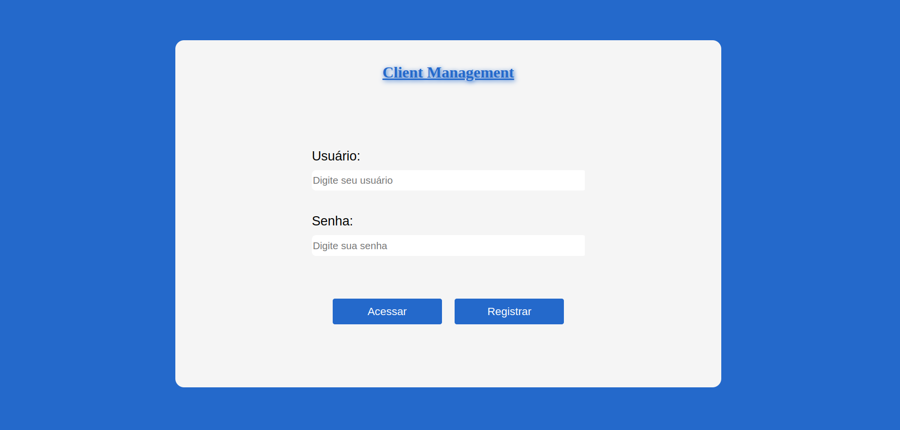
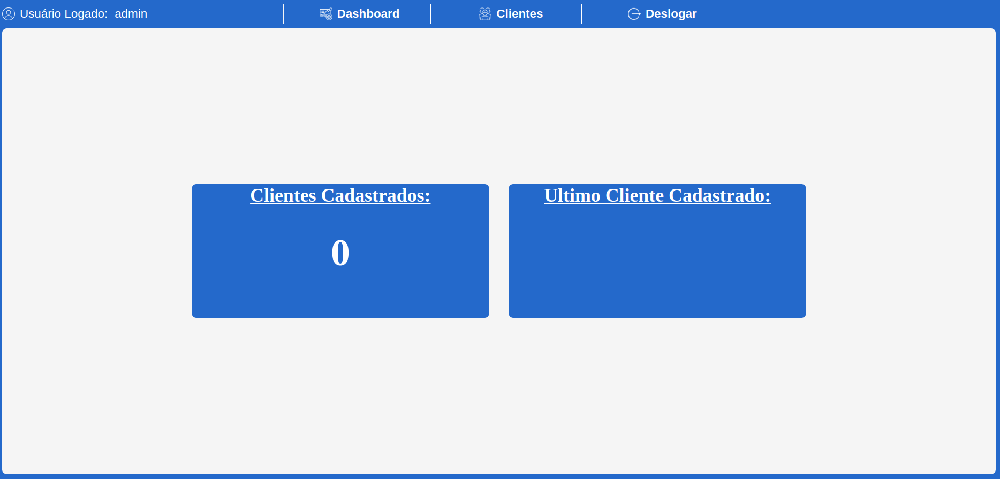
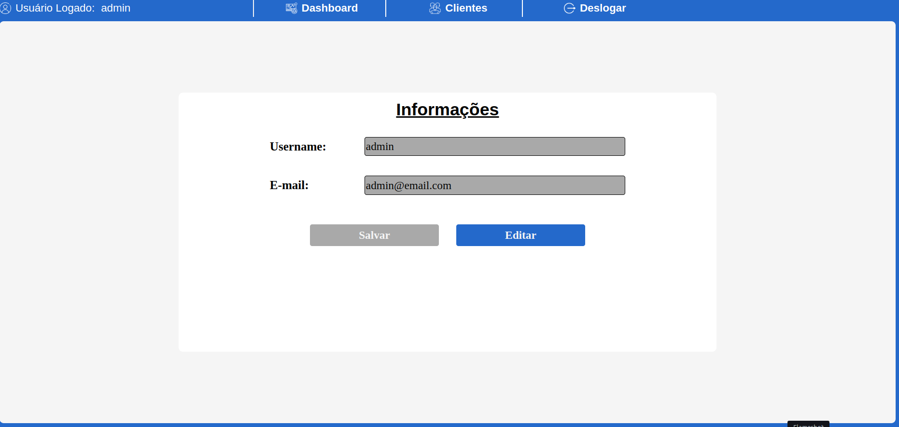
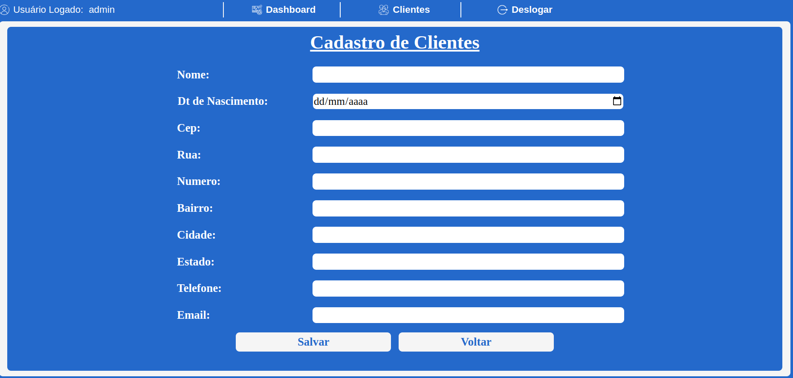
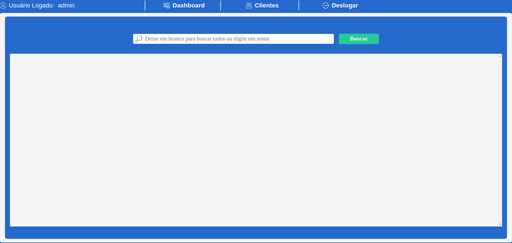

# Projeto de Gerenciamento de Clientes

## Introdução:
Esse projeto tem como objetivo o estudo e a implementação de uma aplicação completa no docker. A estrutura   da aplicação foi dividida em 3 frentes, sendo elas: Backend, Frontend e Testes, siga o passo a passo abaixo para   para conseguir rodar o projeto em sua maquina.
 
 

## Backend
### Instalação
    - git clone https://github.com/AllanScala1991/management-clients-docker
    - cd management-clients-docker/backend
    - npm install
    - npm run start

### Variaveis de ambiente .env
- DATABASE_URL : URL do seu banco de dados
- SECRET_TOKEN : token md5 hash
- CEP_API : URL da API do Viacep
- USERNAME : usuário ADMIN ("O mesmo deve ser criado após iniciar a aplicação")
- PASSWORD : senha do usuário ADMIN ("O mesmo deve ser criado após iniciar a aplicação")
 
 
### Tecnologias utilizadas
- Express
- Typescript
- Prisma
- Axios
- Email Validator
- JsonWebToken
- Bcrypt
 
 

## Frontend
### Instalação
    - cd management-clients-docker/front
OBS: É necessario subir um docker com nginx ou criar um http server.
 
### Tecnologias utilizadas
- HTML
- CSS
- Javascript
- Jquery
- Sweet Alert
 
### Screenshots
LOGIN

HOME

USER

CUSTOMER

REPORT

 
 

## Testes
### Instalação
    - cd management-clients-docker/tests
    - npm install
    - npm run open

### Variaveis de ambiente .env
- BASE_URL : URL do seu frontend
- LOGIN : usuário ADMIN ("O mesmo deve ser criado após iniciar a aplicação")
- PASSWORD : senha do usuário ADMIN ("O mesmo deve ser criado após iniciar a aplicação")
 
 
### Tecnologias utilizadas
- Cypress
- Typescript
- Chance
 
 